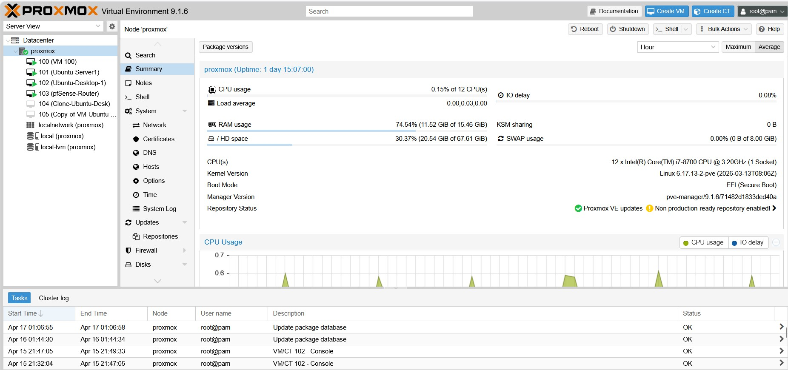

# infrastructure-home-lab
# Infrastructure Home Lab Portfolio

This repository documents my hands-on infrastructure and virtualisation lab environment, built using Proxmox VE as part of my Graduate Certificate in Networking & Systems Administration.

The purpose of this lab is to develop practical, real-world skills in systems administration, virtualisation, and network troubleshooting.

---

## 🔧 Technologies & Platforms

* Proxmox VE (Type-1 Hypervisor)
* Windows Server 2022
* Ubuntu Server (Linux)
* Virtual Networking (bridges, isolated networks)
* Basic VLAN and segmentation concepts

---

## 🖥️ Lab Environment

* Host: Lenovo ThinkStation P330 Tiny
* Hypervisor: Proxmox VE
* Virtual Machines:

  * Windows Server 2022
  * Ubuntu Server
  * Test client machines

---

## 🌐 Key Skills Demonstrated

* Virtual machine provisioning and resource allocation
* Configuration of virtual bridges and multi-network environments
* Troubleshooting VM connectivity and firewall issues
* Understanding of internal vs external networking concepts
* Application of networking fundamentals (IP addressing, routing concepts)

---

## ⚙️ Key Learning Outcomes

* Built and maintained a working virtualisation environment from scratch
* Diagnosed and resolved real connectivity issues between networks
* Applied theoretical networking concepts in a practical environment
* Improved Linux command-line and system administration skills

---

## 📂 Documentation

* [Proxmox Setup & Lab Summary](docs/proxmox-lab-summary.md)

---

## 🚀 Ongoing Development

This lab is actively being expanded to include:

* VLAN segmentation
* High availability concepts (N+1 design)
* Automation and scripting (PowerShell / Python)
## 📸 Screenshots

### Proxmox Virtual Machines

### Network Topology

### pfSense WAN Rules

### pfSense OPT1 Rules

