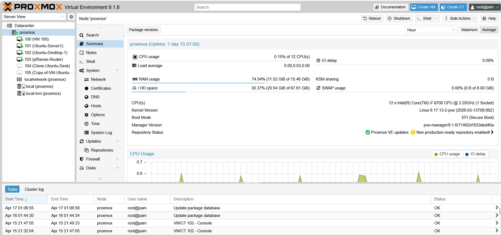

# Infrastructure Home Lab Portfolio

> Hands-on virtualisation and infrastructure lab built using Proxmox VE, demonstrating practical systems administration and network troubleshooting skills.

This repository documents my hands-on infrastructure and virtualisation lab environment, built using Proxmox VE as part of my Graduate Certificate in Networking & Systems Administration.

This lab was built to develop and demonstrate practical, real-world skills in systems administration, virtualisation, and network troubleshooting.

---

## 🔧 Technologies & Platforms

* Proxmox VE (Type-1 Hypervisor)
* Windows Server 2022
* Ubuntu Server (Linux)
* pfSense Firewall/Router
* Virtual Networking (bridges, isolated networks)
* LVM-Thin Storage
* Linux Filesystems and Persistent Mounting
* Basic VLAN and segmentation concepts

---

## 🖥️ Lab Environment

* Host: Lenovo ThinkStation P330 Tiny
* CPU: Intel Core i7-8700
* RAM: 16 GB
* Hypervisor: Proxmox VE 9.1
* Storage:
  * 256 GB NVMe SSD (Proxmox host OS and local-lvm storage)
  * 1 TB NVMe SSD configured for:
    * LVM-Thin VM storage
    * ext4 directory storage
* Virtual Machines:
  * Windows Server 2022
  * Ubuntu Server
  * Ubuntu Desktop
  * pfSense Router/Firewall

---

## 🌐 Key Skills Demonstrated

* Virtual machine provisioning and resource allocation
* Configuration of Proxmox virtual bridges and segmented network environments
* Troubleshooting VM connectivity, routing, and Windows firewall issues
* Deployment of Linux and Windows Server virtual machines using VirtIO drivers
* VM administration tasks including snapshots, cloning, and disk expansion
* Configuration of static IP addressing and internal routing concepts
* Expansion of Proxmox storage using additional NVMe storage devices
* Configuration of LVM-Thin and ext4-based directory storage
* Persistent Linux filesystem mounting using /etc/fstab
* Practical Linux storage administration using lsblk, blkid, mount, and df -h

---

## ⚙️ Key Learning Outcomes

* Built and maintained a working virtualisation environment from scratch
* Applied practical Linux systems administration concepts in a virtualised environment
* Diagnosed and resolved networking, routing, and firewall issues across segmented networks
* Implemented Proxmox storage expansion using LVM-Thin and ext4 directory storage
* Improved understanding of virtualisation architecture, storage concepts, and VM lifecycle management
* Strengthened troubleshooting and infrastructure problem-solving skills through hands-on lab work

---

## 📂 Documentation

* [Proxmox Setup & Lab Summary](docs/proxmox-lab-summary.md)

---

## 🚀 Ongoing Development

This lab is actively being expanded to include:

* NFS shared storage
* VLAN segmentation
* High availability concepts (N+1 design)
* Backup and recovery testing using Veeam
* Automation and scripting (PowerShell / Python)
## 📸 Screenshots

### Network Topology

### Proxmox Virtual Machines

### pfSense WAN Rules

### pfSense OPT1 Rules

